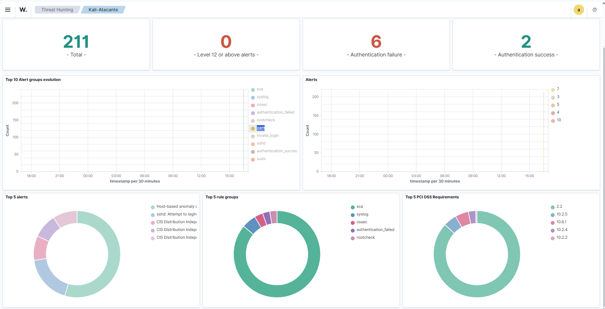

# Construindo um SOC com Wazuh (SIEM) 🛡️

Neste laboratório, mudei o chapéu de "Atacante" para "Defensor". Meu objetivo foi criar um ambiente de monitoramento centralizado para detectar tentativas de intrusão em tempo real.

Utilizei o **Wazuh**, uma das ferramentas de SIEM (Security Information and Event Management) mais usadas no mercado.

## ⚙️ Arquitetura do Lab
* **Wazuh Server:** O servidor central que recebe e analisa os logs.
* **Wazuh Agent:** Instalado na minha máquina Kali Linux para atuar como sensor de segurança.
* **Integração:** O agente coleta logs do sistema operacional e envia para o servidor via rede criptografada.

## 🚨 O Teste: Detecção de Brute Force
Para validar se o monitoramento estava funcionando, simulei um ataque de força bruta no serviço SSH do agente:
1.  Tentei login repetidamente com usuário inexistente (`hacker`) e senhas erradas.
2.  O objetivo era gerar ruído nos logs de autenticação (`auth.log`).

## 📸 Resultado: Alerta em Tempo Real
O Wazuh detectou o padrão de falhas imediatamente. Como mostra o dashboard abaixo, ele registrou **6 falhas de autenticação** consecutivas, classificando o evento como suspeito.

## 🔧 Desafios de Implementação
Configurar um SIEM envolve garantir que o Agente e o Servidor consigam se falar através da rede.

* **O Problema:** Garantir a comunicação entre o Kali Linux (Agente) e o Wazuh Server em um ambiente virtualizado.
* **A Solução:** Configurei a rede das máquinas virtuais em modo **Bridge** para garantir que ambas recebessem IPs válidos na mesma sub-rede, permitindo o envio de logs na porta 1514/TCP.

## 🧠 Aprendizado
Este projeto me permitiu entender na prática como funciona a rotina de um **Analista de SOC**: não basta apenas ter logs, é preciso ter uma ferramenta que correleciona esses dados e gera visualizações úteis para tomada de decisão.

---
*Projeto de estudo em Blue Team.*
